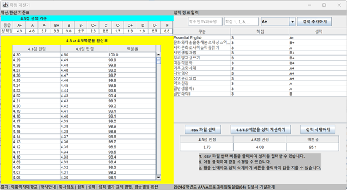

# 학점 계산기

개발자: @kkys00

## 1. GUI
  
① 왼쪽 패널 – 성적 기준 보는 패널  
	1) 알파벳 등급별 4.3점 성적 기준  
	2) 4.3점 만점 성적을 4.5점 만점 성적과 백분율로 환산하는 환산표  
② 오른쪽 패널 – 사용자의 인풋을 처리하는 패널  
	1) 학수번호/과목명, 학점, 성적을 직접 입력하는 텍스트 필드  
	2) 사용자가 입력한 정보를 테이블로 표시  
	3) .csv 파일 선택 버튼을 클릭하여 입력 가능  
	4) 성적 계산하기 버튼을 클릭하여 아래 결과표에 환산 성적 표시  
	5) 테이블에서 행을 선택하고 성적 삭제하기 버튼을 클릭하여 입력한 정보 삭제  

## 2. 코드 및 동작 설명

### 1. main – GPACalc 객체 생성으로 프로그램 실행
	
### 2. 생성자 상단  
① 알파벳 등급(A+, A, A-, ...)에 대한 4.3점 만점 점수 사전 생성  
②왼쪽 패널 테이블에 표시할 4.3 -> 4.5/백분율 환산 배열 생성  
1) 4.5점 만점은 환산표에서 규칙을 찾아 계산하는 함수 작성  
2) 백분율은 이화여자대학교 홈페이지에 게시된 환산식 사용  

### 3. 왼쪽 패널
(1) title/footer,   
(2) 4.3점 만점 기준을 table로 표시  
(3) 4.5점 만점 성적 및 백분율 성적 환산표 생성 - 생성자 상단에서 생성해둔 배열 사용  

### 4. 오른쪽 패널
(1) title/footer,  
(2) 입력할 정보를 표시할 테이블 생성  
1) 행 삭제를 구현하기 위해 테이블에 MouseListener 추가하여 선택한 행을 selectedRow 변수에 저장

(3-1) 정보를 입력받을 텍스트 필드와 콤보 박스
1) 성적 추가하기 버튼(addGrade)를 클릭할 시 텍스트들을 읽어와서 테이블에 추가함
2) 텍스트 필드를 채우지 않으면 메시지창을 표시함  

(3-2) 결과 표시 테이블

(4) 버튼 3개 구현  
① 성적 계산 getResult 버튼  
1) 버튼 클릭 시마다 테이블 내용을 토대로 다시 계산  
2) 4.3점 만점, 4.5점 만점, 백분율 결과를 결과 테이블에 표시  
② 테이블 행 삭제 버튼 deleteRow  
1) 테이블에 연결된 selectedRow 값을 토대로 다이얼로그 메시지창을 띄워서 삭제 의사 확인 후 테이블에 삭제 반영  
③ csv 파일 입력 버튼 putFile   
1) csv 파일을 입력 받아 테이블에 표시  
예시 csv 파일 위치: 프로젝트 폴더 안 data.csv 파일  
